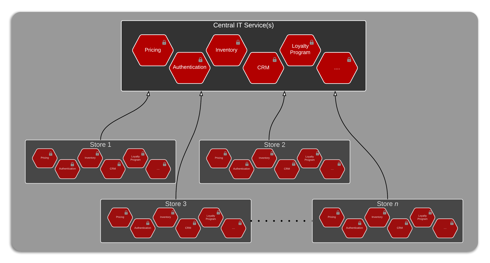
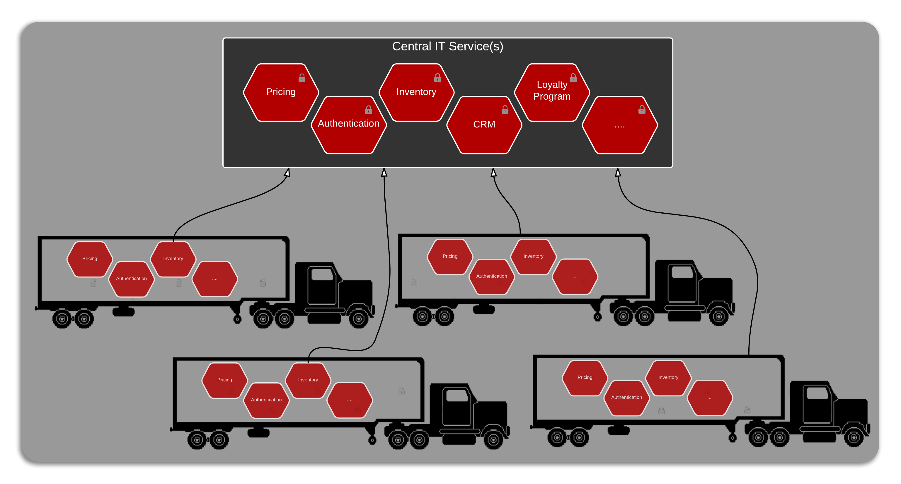

# Special case of retail business
A very large retailer in Australia, with approximately 1000 supermarkets, 1000 mini-stores, and 1000 specialist stores like liquor, etc is in the midst of establishing an API strategy.  This article will refer to the retailer as *RA*.  

Recently, I had the opportunity to discuss with _RA_ their API strategy. It would be fair to say that security was their number 1, 2, and 3 cross-cutting concern.  It is easy to understand why with the customer information available in various loyalty programs/systems.  The recent publicity around overseas retailers' customer databases being compromised has placed extra focus on securing services at each layer.

> Just because Service A can access Service B doesn't mean Service A should be allowed to Service B.  Service A should be explicitly granted permission to access Service B.

The nature of brick and mortar retail business is such that IT support systems within individual stores must be operational irrespective of the central IT systems being online or offline.  According to the technical team at *RA*, redundancy is built into every layer of the IT system at each store.  For e.g. a dual redundant internet link to the central IT office, data syncing / offline capability within handheld devices used in stores, etc.

Another point worth noting is that local stores maintain *replica* of a few of the services provided by central IT systems.  Functions like authentication, pricing policy, etc need to be controlled by individual stores.

In addition, the IT systems at each store are very tightly controlled with a very rigid deployment schedules.  Deploying *extra* hardware/infrastructure at these stores is extremely cost prohibitive.  As such a minimal footprint is the ideal profile for services running in local stores.

## Parallels with the logistics industry
While discussing these issues with _RA_, the similarities between the IT concerns shared by the logistics and retail industries were fairly obvious.

### 1. Securing devices/services at the edge
Just like the systems and devices deployed in stores, the devices and services running in individual trucks and vans handling goods need to be secured as well.  In both the cases these *edge* services contain commercially sensitive data which needs an appropriate security profile applied to.

### 2. Loosely coupled with central IT system
Both the stores and vehicles need the ability to remain operational, irrespective of the central systems being online or offline.  Along with a requirement for builtin redundancy, the IT systems also require complex capabilities like caching and data-sync.  Selling of items at stores can not be interrupted if central IT system has gone offline (or internet is down).  Similarly the vehicles almost operate in a *standalone* mode while they are away from the company warehouse.

### 3. Operating local systems/services
In both the cases it is required that a subset of central IT functions be performed locally.  For e.g. authentication, inventory, etc.  Additionally load-balancing capability is also required.  Whereby the *edge* entity (store or vehicle) be able to configure the sequence in which services be *invoked*.  E.g. try the local inventory first, and then query central inventory **-OR-** use local pricing system before getting the price from central system.

### 4. Small footprint of the services
The infrastructure and devices running software in both cases is pretty small from a capacity point of view.  This requires that the services developed for edge infrastructure have a minimal footprint.

### 5. Large number of edge systems
Both retail and logistics industries need to manage a large number of IT services at the edge.  A decent sized logistics company would be operating a few thousand trucks.  Managing and operating these thousands of *satellite* systems is not too dissimilar to managing and operating a few thousand individual stores.  
Further more, the services and devices installed and used at the edge is ever evolving. These edge components are agile in nature with constant changes required.  The best way to manage these changes would be centrally, but application of these changes happens at the edge.  In simpler terms, new or changed services are made available by central IT, but actually deploying the services is administered at the edge.

The large number of devices/services involved, along with the *remote* nature system interactions makes this scenario lot similar to IoT -_internet of things_- pattern.

## Using logistics patterns within retail industry
Logistics vertical has been leveraging design patterns around *IoT*, well before *IoT* term was coined. [A following blog post](./api-management-leveraging-logistics-patterns-in-retail) investigates how we can leverage learnings from logistics vertical as we work towards a conceptual architecture for digital strategy of retail industry.
