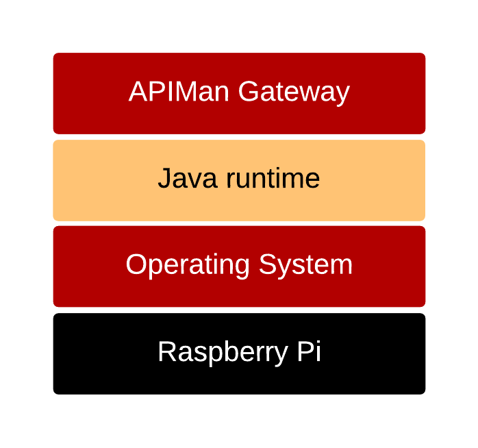

# API Management within Retail business
An API *-Application Programming Interface-* driven economy forms the backbone of the ongoing digital revolution.  In simple terms, API allows a business to offer consistent, secure, and reusable business functions to the market.  This approach is critical to enable a consistent customer experience when engaging with the business, irrespective of the channel used.

Ability to offer the same business service on a different plan is the added benefit of API driven economy.  E.g. being able to offer the same service as part of Gold, Silver, or Bronze plan.

Many of the retail companies have started investigating API platforms as part of their digital strategy.  A decent sized retail company would have hundreds of stores if not thousands.  As soon as we get to these number in a distributed and remote deployment pattern, _IoT_ style of integration patterns should be considered for management and deployment of edge services (functional devices and services deployed in individual stores).

[In a previous article](./similarities-between-retail-and-logistics), I have outlined how the retail IT services scenario is lot similar to IoT style of design pattern.   
Logistics vertical has been dealing with these _IoT_ style issues for a long time. There are many learning from logistics vertical that should go into an  architecture for digital strategy of a retail industry.

## Overview of API Management
I am using [APIMan.io][d8964191] as a API management solution for the purpose of this article.  In terms of functionality, API management as a solution can be broken down into two components:
1. API Manager
2. API Gateway

### API Manager
Provides centralised management of APIs.  API Manager is the brains of the API management platform.  Using API Manager end-user can perform following functions:
1. Manage policies like throttling, centralised security, mutual authentication, etc.
2. Manage plans by combining multiple policies if required.
3. Create, implement, and define APIs
4. Track and configure metrics for APIs
5. Publishing APIs in the Gateway
6. Creating API consumers
7. Creating API contracts for consumers
8. Registering consumers in the Gateway

All functions provided by API Manager are exposed as REST API. API Manager also provides a simple User Interface _UI_ to facilitate user interaction.

### API Gateway
API Gateway is a lightweight embeddable artifact, which is responsible for applying the policies configured in the API Manager, to control all the requests to managed APIs.  It can deployed independently of API Manager. API Gateway exposes following functions using a simple REST API:
* Publish and API
* Register a Client App (with contracts)
* Retire an API
* Unregister a Client App

The beauty of this lightweight API gateway is that,  it can be pre-configured and deployed into simple cheap devices like a Raspberry Pi.  (At the time of writing this article, the total cost of each gateway would be less that $100).  Then its just a matter of shipping these Gateways out to the stores.  These pre-configured Gateways can be managed centrally using the API Manager.  They can also be secured by using mutual authentication between API Manager and API Gateway.  
Multiple units could be shipped to local store(s) if any failover strategies are to be employed.

> API Gateway can be deployed in traditional model (physical, virtual, cloud, etc). Rasberry Pi is suggested as an option as it fits the IoT pattern of *replace the faulty device with a new one* as apposed to *fixing the faulty device*.

## Benefits of this strategy
1. The core processing and management is centralised.
2. API Gateways have a large footprint.  And this strategy commoditises API Gateways.
3. Core IT services can be provided to any *pop up stores* during an event by simply deploying the API Gateway at the pop up store during the event.
4. Similar process would work for temporary shops out of the back of a van or mobile trucks (or delivery stores).
5. Ability to deploy _IoT_ devices and functions at the edge (local stores) and update the appropriate API Gateways as required.
6. Enable the delivery trucks to *update* the store inventory as soon as they enter a desired zone (loading bay) via the store's API Gateway.

  [d8964191]: http://apiman.io "APIMan.io"
