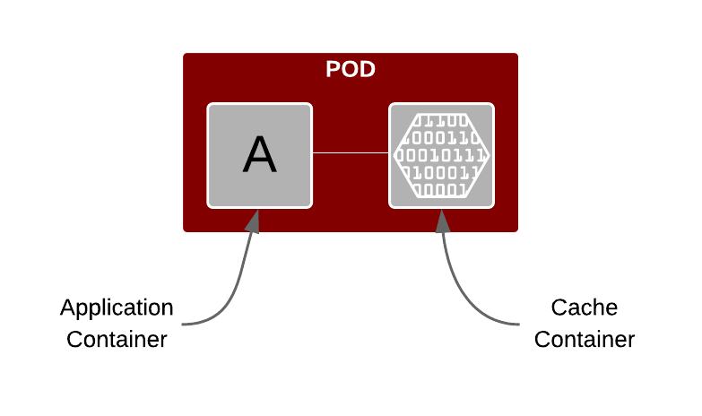
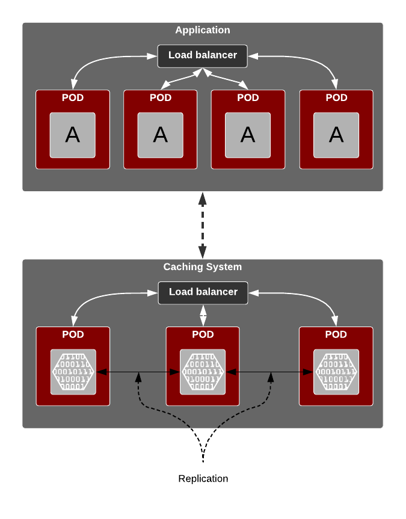
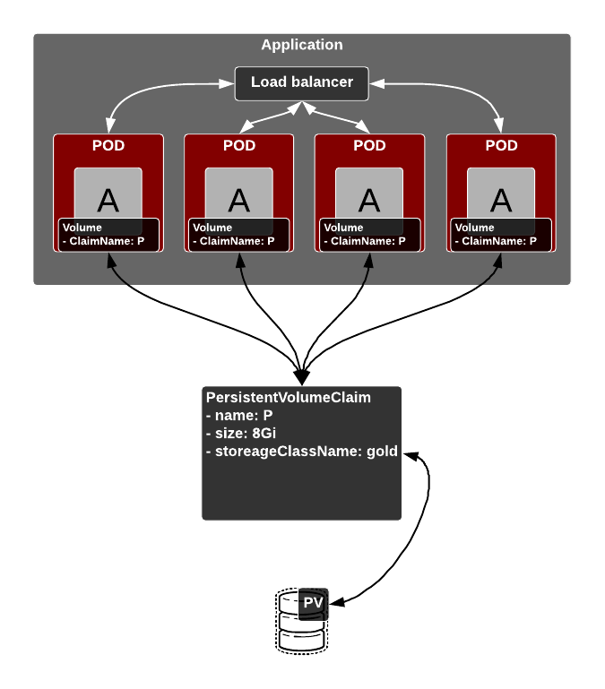
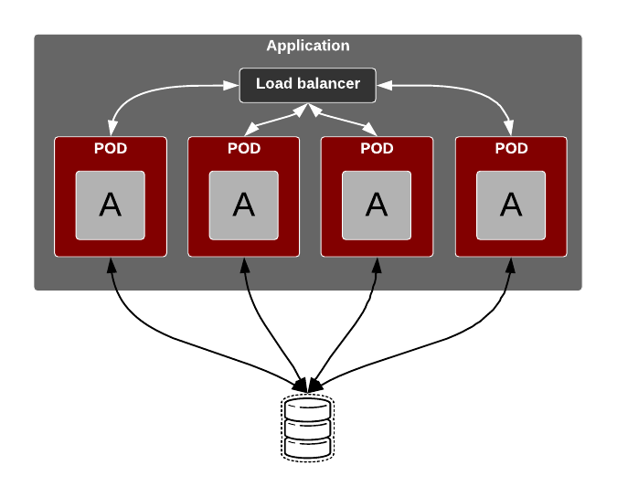

# Maintaining State when deploying Application on Kubernetes

## Overview

[Linux containers][1] should be _disposable_ (or emepheral is a more technical term). Meaning that a container should be treated as an _immutable_ software asset which includes the base operating system, software libraries (required dependencies), configuration, folders, and the application itself.  

This immutable nature requires that no data is stored within the container[^1].  

## How do you maintain state

A key advantage of _containerising_ application is that the image (template for the container) that was tested in QA is guaranteed to have the same behaviour in production environment.  So to maintain state (store data) with a containerised application, we can employ three (3) patterns:

1. Caching
2. Persistent Volumes
3. External storage

### Caching

The diagram above gives a highlevel view of a [POD](2) with an application container and a caching container.  The idea is to cache relevant information into the container providing caching capability.

Scaling the application is as simple as scaling the POD and it will automatically scale the cache.  Point to note is that the cache is native to the specific application container running in the same POD as the application container itself.

In many scenarios, it might make more sense to _externalise_ caching sub-system and lifecycle manage it, independently of the application container.  Diagram below gives us a highlevel view of what that pattern would look like.

#### Persistence of Cache

Persisting data held within a cachee might be desirable for reasons like:
1. Memory is volatile, so a cache store could increase the durability of the information
2. Write-through as an mechanism to use cache as a layer between an application and external storage subsystem
3. To retain _hot_ data (frequently used) data in memory, and _passivate_ less frequently used data to a backend store

Caching systems like [Infinispan][3] offer sophisticated capabilities like cache store, chaining of cache store, cache passivation, cache loaders, etc.  

- **Cache store**: Persistence allows configuring external stores based on filesystem, JDBC, JPA, RocksDB, LevelDB, custom store.  
- **Write-through**: this strategy allows information to be persisted in one or more caching stores _synchronously_.  As an example an invocation of `cache.put()` will not return until update is reflected in the caches store(s).
- **Write-behind**: updates to the cache are asynchronously written to the cache store. Normally, this means that updates to the cache store are done by a separate thread to the client thread interacting with the cache.

> For further details on persistence and Infinispan in particular, refer to this [user guide][4].

### Persistent volumes

Managing storage is a distinct problem from managing compute resources. [Kubernetes persistent volume (PV) framework][5] to allows administrators to provision persistent storage for a cluster. Using persistent volume claims (PVCs), developers can request PV resources without having specific knowledge of the underlying storage infrastructure.

It is important to understand the relationship between PODs, PVCs and PV.  In simple terms, a POD uses PVC to _bind_ to the underlying PV.  Once a this binding is established, that PV is _exclusively_ assigned to the requesting PVC.  Meaning that only one PVC is bound to a PV.  

> But note that multiple PODs can claim reference to the same PVC, which would refer to a single PV.

> For further details on lifecycle of PV and PVC, please refer to the [Kubernetes storage manual][6].

#### Access Modes

Three types of acces modes available for _PersistentVolume_ are (as long as they are supported by underlying resource provider):

- _ReadWriteOnce_ – the volume can be mounted as read-write by a single node
- _ReadOnlyMany_ – the volume can be mounted read-only by many nodes
- _ReadWriteMany_ – the volume can be mounted as read-write by many nodes

### External storage

This pattern employs an _external_ data store.  Meaning that the information resides in a database (or any data store), which is hosted outside the Kubernetes platform.  Typically this will be provided as a database as a service.  So that any application or a service residing in a POD on the Kubernetes cluster will simply access the database service to store or retrieve data at rest.

## Maintaining state across Kubernetes cluster

### Cache

_Remote cache store_ configuration allows storing information in a remote cache cluster.  This can be an interesting configuration for persistence across regions.

### Persistent Volumes

Below is a list of commonly used types of persistent volumes.  Majority of these provide a native data replication capability.
- NFS
- HostPath
- GlusterFS
- Ceph RBD
- OpenStack Cinder
- AWS Elastic Block Store (EBS)
- GCE Persistent Disk
- iSCSI
- Fibre Channel
- Azure Disk
- Azure File
- VMWare vSphere
- Local

### External Storage

Majority of the external storage systems offer a native replication mechanism.  Few examples:
1. [EDB Postgres Database Replication Solution][7]
2. [SQL Server replication][8]
3. [Oracle RAC][9]

[1]: https://www.opencontainers.org/
[2]: https://kubernetes.io/docs/concepts/workloads/pods/pod/
[3]: http://infinispan.org
[4]: http://infinispan.org/docs/stable/user_guide/user_guide.html#persistence
[5]: https://kubernetes.io/docs/concepts/storage/persistent-volumes/
[6]: https://kubernetes.io/docs/concepts/storage/
[7]: https://www.enterprisedb.com/solutions/replication
[8]: https://docs.microsoft.com/en-us/sql/relational-databases/replication/sql-server-replication?view=sql-server-2017
[9]: http://www.oracle.com/technetwork/database/options/clustering/overview/index-086583.html

---

[^1]: [_Do's_](https://docs.docker.com/develop/develop-images/dockerfile_best-practices/) and [_don'ts_](https://developers.redhat.com/blog/2016/02/24/10-things-to-avoid-in-docker-containers/) of working with Containers
