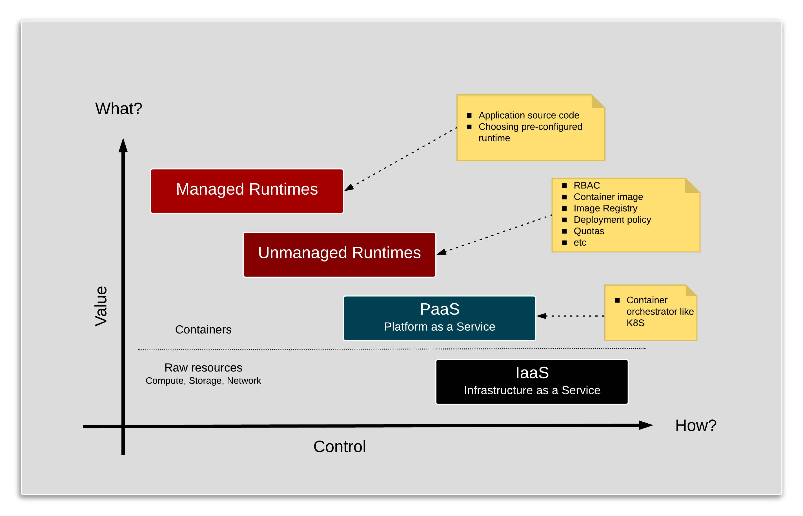

# Evolution of Platform as a Service

## Overview

Three well known cloud service models are:
1. _**IaaS**_: Infrastructure as a Service
2. _**PaaS**_: Platform as a Service
3. _**SaaS**_: Software as a Service

_IaaS_ and _SaaS_ are well understood models.  Though as _linux containers_ go mainstream, the _PaaS_ model is ever evolving.  

_PaaS_ provides a wide spectrum of configuration points for customers to design their services.  As an example, in a true _function as a service model_[^1] the customer could simply provide source code to perform a task when a certain condition is triggered.  At the other end of the spectrum, the customer might want to design a service bottom up.  Meaning piecing together all the building blocks to define how the service is constructed.

So at one end of the spectrum, you are dealing simply with **what** task needs to be performed.  While at the other end of the spectrum, you are dealing with not only **what** but also **how** that service is technically built, which in turn requires that the service is appropriately delivered and life-cycle managed.

## Value vs. Control in PaaS

As highlighted by the picture above, as higher up the stack you _bind_ your application, lesser the amount of _[techincal debt][7]_ you will incur and carry forward.  In turn you have less control of  **how**.  It would seem that this trade-off is well understood (may be apprecaited?) but often overlooked[^2].

Even with the obvious value being derived higer up the stack, the development community generally prefers to work with the _PaaS_ layer if not _IaaS_.  

Looking back, adoption of _IaaS_ (EC2, Google Compute Engine) was fastracked by developers.  As it provided developers with a sense of being in control of their (project's) destiny.  The key enabling features of this model were:
1. Self-service capability
2. Backed by an _automated delivery_ of the service or resources

This capability compared to the _concierge_ style of service offered by traditional IT shops made _IaaS_ service providers extremely popular with developers.  As lead times of days and weeks if not months required by traditional IT shops to provision environments wasn't uncommon.

### The _PaaS_ Layer
Now as containers are becoming popular with developers, the true _PaaS_ model is becoming popular with the developers.  Most common technology used in implementing this _PaaS_ model is [Kubernetes][1].  Popular examples of this service:
1. GKE: [Google Kubernetes Engine][2]
2. AKS: [Azure Kubernetes Service][3]
3. EKS: [Amazon Elastic Container Service for Kubernetes][4]
4. [Red Hat OpenShift Online][5]
5. [DIY][6]

Even in this model, the developer community is really treating _PaaS_ as if it was working with _IaaS_.  As an example, to make it _enterprise_ ready, _raw_ Kubernetes requires scafolding around it with features like:
1. RBAC strategy
2. Storage options
3. Container Image Registry
4. Deployment policies
5. Life-cycle management of running containers
6. Tooling for CI/CD pipelines

This pattern places enormous faith and responsiblity on the developers to consistently make the right choice at every decision point.  

As an example consider all the decisions that would influence the supportability matrix for all the applications in the enterprise.  Below is just a small snapshot of this example.

Application name | Kubernetes version | RBAC integration | Block Storage | File Storage | Deployment rules
- | - | - | - | - | -
ATM locator | 1.11 | None | Persistent Disk SSD (Google) | Google Drive | No access to _customer_ data
Branch locator | 1.10 | Node | Premium Disk (Azure) | Azure Files | No access to _customer_ data
Loan approval | 1.9 | Active Directory | Pure Storage | Gluster File System | No access to DMZ

---

In addition horizontal concerns like detecting, isolating and re-cycling of _vulnerable_ containers is an abosolute must from a security perspective.

As you can imagine, majority of these capabilities are required to deliver enterprise services by any project.  So either each project invests in building and managing their own _scafolding_ or these capabilities are provided via centralised _Unmanaged runtime_ as a service model.

### The _Unmanaged_ Runtime Layer

This particular layer focuses on providing standard and consistent container services across the enterprise; including build delivery and life-cycle management of individual containers.

This allows the developers to focus on runtimes required to build applications.  The runtimes in this instance are the programming languages, frameworks, databases, etc.

This is a good starting point for startups and new enterprises.  But very soon a few consistent runtimes emerge, which are leveraged by the developers time and again.

### The _Managed_ Layer
There is a case to be made that even these runtimes are managed in a standard and consistent manner.

Choosing and managing a runtime in container could be an involved process.  For instance consider the example below.  

#### Example
> **Optional**  
> This _example_ is meant as an illustration for technically minded people to help understand how some of the technical decisions made could have an impact in the longer run.

##### The OS matters
At present, the size of containers is very _topical_.  Especially developers are very keen to use small container.
Lets take an example of a simple _c program_ below.
```c
/*
 * File: hello_world.c
 * Simple program that prints 'Hello World' message
 */
#include <stdio.h>

int main(){
	printf("\t===========\n");
	printf("\tHello World\n");
	printf("\t===========\n");
	return 0;
}
```

Compile the code using following command.  
```bash
cc hello_world.c -o hello_world
```

This will create an executable called `hello_world`.  Executing it gives you the below output.
```bash
	===========
	Hello World
	===========
```

##### Fedora based container
Build a _fedora_ based container image using the following 'Dockerfile_fedora'
```Dockerfile
FROM fedora:27

RUN dnf -y clean all && dnf -y update
COPY hello_world /tmp/hello_world
```

Built the image and run the 'c' program within the container.
```bash
# Build the docker image
docker build -t fedora-4-c -f Dockerfile_fedora .
# Run the container
docker run fedora-4-c /tmp/hello_world
```

Gives us the expected output:
```
	===========
	Hello World
	===========
```

##### Debian based container
Build a _debian_ based container image using the following 'Dockerfile_debian'
```Dockerfile
FROM debian:8

RUN apt-get update
COPY hello_world /tmp/hello_world
```

Built the image and run the 'c' program within the container.
```bash
# Build the docker image
docker build -t debian-4-c -f Dockerfile_debian .
# Run the container
docker run debian-4-c /tmp/hello_world
```

Gives us the expected output:
```
	===========
	Hello World
	===========
```

##### Alpine based container
Build an _alpine_ based container image using the following 'Dockerfile_alpine'
```Dockerfile
FROM gliderlabs/alpine:latest

COPY hello_world /tmp/hello_world
```

Built the image and run the 'c' program within the container.
```bash
# Build the docker image
docker build -t alpine-4-c -f Dockerfile_alpine .
# Run the container
docker run alpine-4-c /tmp/hello_world
```
> Running this container results in an **Error**!

Gives us the following error message:
```
standard_init_linux.go:178: exec user process caused "no such file or directory"
```

## Commercial Perspective

Anecdotal data suggests that 80% of the containerised applications are _stateless_ in nature.  And if running in public cloud, these applications could potentially be a significant _consumer_ of resources.  Now if we think of public cloud providers as providers of utility services, then we should be able to tap into the best available rates and service.

In that scenario, it is critical to develop applications higher up the stack than _raw_ Kubernetes.  And we do that by using a common deployment platform across internal and the three public cloud (EC2, Google Cloud, Azure) providers.

[1]: https://kubernetes.io
[2]: https://cloud.google.com/kubernetes-engine/
[3]: https://azure.microsoft.com/en-au/services/kubernetes-service/
[4]: https://aws.amazon.com/eks/
[5]: https://www.openshift.com/products/online/
[6]: https://kubernetes.io/docs/setup/scratch/
[7]: https://en.wikipedia.org/wiki/Technical_debt
[8]: https://cloud.google.com/appengine/
[9]: https://www.techrepublic.com/article/google-admits-original-enterprise-cloud-strategy-was-wrong-why-its-gone-in-a-different/

---

[^1]: Function as a service ([FaaS][1]) is a category of cloud computing services that provides a platform allowing customers to develop, run, and manage application functionalities without the complexity of building and maintaining the infrastructure typically associated with developing and launching an app.  
[^2]: In 2008, Google launched its cloud service with [AppEngine][8] only.  Eric Schmidt, then Google CEO says - "There’s something fundamentally wrong with what we were doing in 2008, we didn’t get the right stepping stones in to the cloud.”.  [Here][9] is the full news article, which is worth reading.