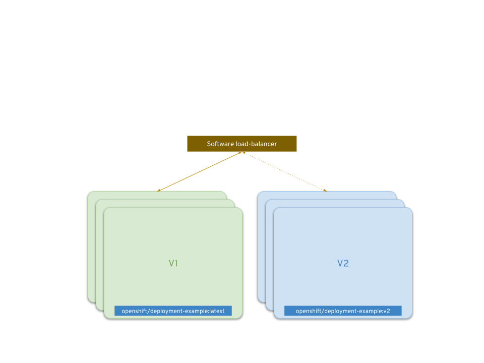

# And Example of Zero Downtime Deployment

## Overview

[Kubernetes][1] based platforms like [OpenShift][2] support zero downtime deployments using advanced deployment strategies like:
1. [Blue-Green Deployment][3]
2. [A/B Deployment][4]
3. [Proxy shard / Traffic Splitter][5]

> Most of these patterns require that your application supports [N-1 Compatibility][^1]

## An Example

### Step 1. Login using CLI
```bash
oc login [api-url] --token=[token]
```

### Step 2. Download the example from Docker hub
```bash
docker pull openshift/deployment-example
```

### Step 3. Create a new project
```bash
oc new-project rolling
# Ensure we are using the created project
oc project rolling
```

### Step 4. Create an application based on the example image downloaded
```bash
oc new-app openshift/deployment-example
```

### Step 5. Expose the service to the external traffic
```bash
oc new-app openshift/deployment-example
```

### Step 6. Get external endpoint for the service
```bash
oc get routes
```

> The external endpoint should be identified by **HOST/PORT** for _deployment-example_

### Step 7. Scale the deployment to 3 replicas
```bash
oc scale dc/deployment-example --replicas=3
```

### Step 8. Create an application with `openshift/deployment-example:v2` image
> This is a workaround so that `openshift/deploymenteample:v2` image is available in the project

### Step 9. Trigger `rolling` deployment by changing target image via `tag`
```bash
oc tag deployment-example-2:v2 deployment-example:latest
```

[1]: https://kubernetes.io
[2]: https://www.openshift.com/products/online/
[3]: https://docs.openshift.com/container-platform/3.10/dev_guide/deployments/advanced_deployment_strategies.html#advanced-deployment-strategies-blue-green-deployments
[4]: https://docs.openshift.com/container-platform/3.10/dev_guide/deployments/advanced_deployment_strategies.html#advanced-deployment-a-b-deployment
[5]: https://docs.openshift.com/container-platform/3.10/dev_guide/deployments/advanced_deployment_strategies.html#proxy-shard-traffic-splitter
[6]: https://docs.openshift.com/container-platform/3.10/dev_guide/deployments/advanced_deployment_strategies.html#n1-compatibility

---

[^1]: Since many applications depend on persistent data, you will need to have an application that supports [N-1 compatibility][6], which means you share data and implement live migration between your database, store, or disk by creating two copies of your data layer.


